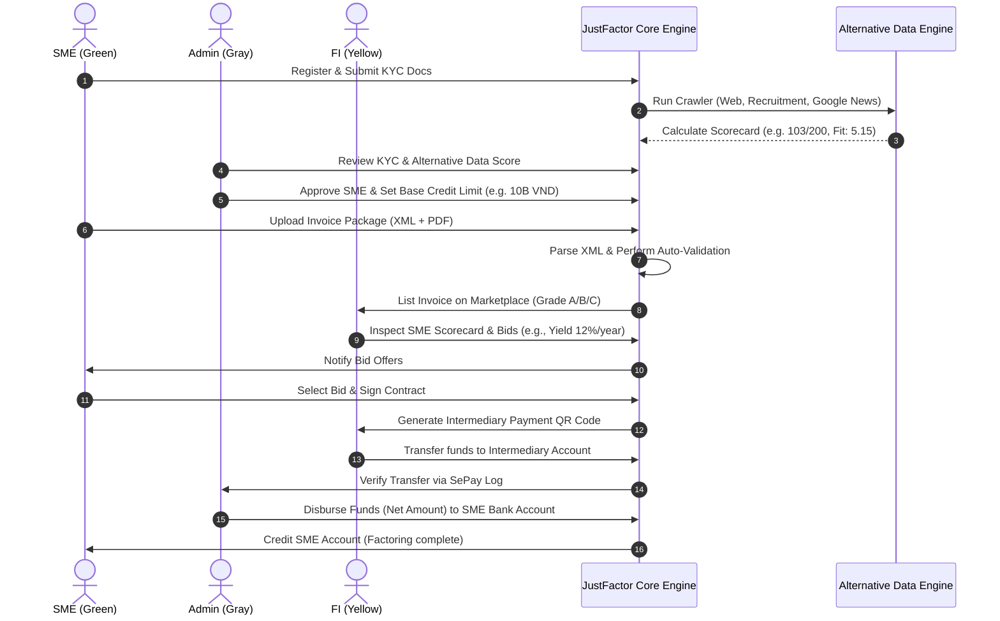
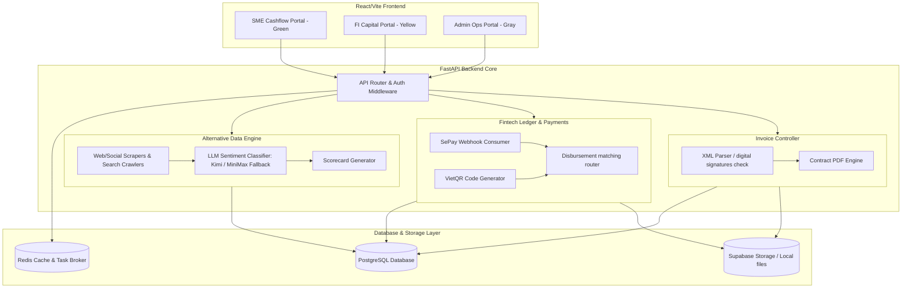

# Spec: JustFactor Platform Architecture & Userflow

## About & Credit Engine Core

JustFactor is a multi-tenant invoice factoring platform designed for Small and Medium Enterprises (SMEs) in Vietnam. Traditional credit scoring often excludes SMEs due to lack of audited financial histories. JustFactor resolves this by implementing a **hybrid credit scoring and alternative data assessment system** to unlock early working capital:

1. **Approved Credit Line**: A baseline credit limit (e.g., up to 10B VND) granted to SMEs upon successful KYC approval by platform administrators.
2. **Alternative Data Assessment Engine**: A non-traditional credit signals engine that evaluates a business's public digital footprint. It computes a 10-point scale scorecard (displayed as `Score/200` and `Fit/10` in the UI) based on:
   - **Digital Presence & Activity (35%)**: Scan of official websites, social pages, and LinkedIn accounts for active engagement.
   - **Recruitment Signals (25%)**: Aggregation of hiring notices on TopCV, VietnamWorks, and LinkedIn to confirm active business operation.
   - **Public Visibility & Reputation (40%)**: Google Search crawler combined with AI sentiment classification to screen for negative news keywords (e.g., fraud, lawsuit, debt) and output risk ratings.
3. **FI Underwriting & Bidding**: Financial Institutions (FIs) leverage the alternative data scorecard inside their Trading Room to gauge repayment probabilities (PD) and make dynamic interest rate bids.

---

## Assumptions

ASSUMPTIONS I'M MAKING:
1. **Tech Stack**: Backend is Python/FastAPI/PostgreSQL, frontend is React (TypeScript/Vite/Tailwind).
2. **Alternative Data Extraction**: Uses Scrapling/Google search APIs/direct HTTP requests, processed through an LLM (Kimi/Gemini/MiniMax fallback) to determine public sentiment risk.
3. **Vietnamese Financial Infrastructure**: Banking reconciliation relies on SePay Webhooks for cash-in and cash-out transaction tracking, with VietQR for automated code generation.
→ Correct me now or I'll proceed with these.

---

## Success Criteria (Reframed)
- **Role Isolation**: Distinct color schemes for each portal (SME = Green/Xanh lục, FI = Yellow/Vàng, Admin = Gray/Xám) without overlapping asset styles.
- **Credit Assessment Display**: Alternative Data Scorecard displays exact numeric scoring metrics (out of 200/10) with risk tags, recruitment signals, and negative reputation flags.
- **Transaction Ledger Integrity**: Multi-party payment matching checks (SME $\rightarrow$ FI $\rightarrow$ Intermediary Account $\rightarrow$ SME) reconcile through simulated SePay callback responses.

---

## 8-Point Analysis

### 1. Goal
Provide Vietnamese SMEs with immediate liquidity by allowing them to bid out verified invoice receivables to Financial Institutions. FIs leverage an AI alternative data engine to evaluate credit risk.

### 2. Input
- **SME Registrants**: Company registration details (MST, Legal Representative name), KYC files (Business license, ID front/back, portrait).
- **Invoice Packages**: XML e-invoice, PDF file, commercial contracts, and delivery receipts.
- **FI Bidders**: Discount rates (% per year), platform fee confirmations, and VietinBank funding transfers.
- **Scraper Engines**: Public social profiles, website URLs, recruitment board entries, and Google Search keywords.

### 3. Output
- **Alternative Data Scorecard**: Detailed metric scores and reputation classification flags.
- **Factoring Contracts**: Legally binding, system-signed PDFs containing disbursement specifics.
- **Ledger Records**: Bank transfer receipts, platform fee audit tables, and transaction matching logs.

### 4. Actors
- **SME User (Cashflow Portal)**: Uploads KYC, manages invoices, signs factoring contracts.
- **FI User (Capital Portal)**: Inspects scorecards, bids on invoices, transfers funds.
- **Admin User (Ops Portal)**: Reviews SME KYC, audits invoice XML structures, verifies banking ledgers.
- **Alternative Data Engine**: Scrapes and analyzes external web indicators using AI.
- **Payment Gateway Link (SePay/VietQR)**: Simulates bank ledger callbacks.

---

## Visual Mappings

### Userflow Diagram

---

### Platform Architecture

---

## Business Rules

1. **Credit Score Dependency**: No invoice can be pushed to the bidding marketplace unless the SME's KYC is approved and their Alternative Data score is updated.
2. **Sanitized Financial Data**: Bank accounts, credentials, and QR codes generated in the staging environment must be masked in customer-facing portals to prevent exposure.
3. **Graceful Fallbacks**: If scrapers/LLM endpoints timeout (e.g., due to proxy latency), the alternative data score uses a deterministic fallback profile rather than returning an error.
4. **Non-Repudiation**: Contracts must be signed by the SME legal representative using verified platform credentials before the payment QR drawer is exposed to the winning FI.

---

## Acceptance Criteria

- **SME Dashboard Verification**: Dashboard correctly displays the base credit limit and alternative data rating with visual grading tags.
- **FI Marketplace Bidding**: FIs can place bids on active invoice cards; platform fee calculations must match the standard 1% rate rules.
- **Reconciliation Logs**: Admin banking feed shows status matching for cash-in and cash-out transaction records.

---

## MVP Scope & Slicing (V1 MVP vs. Not Doing)

### Included in V1 MVP:
- **Role-based Authentication**: Fast switching between SME, FI, and Admin.
- **Scorecard Breakdown**: UI visualization of alternative digital indicators.
- **XML Invoice Parsing**: Extraction of tax codes and invoice values.
- **Simulated Payment Gateways**: VietQR display with dummy QR outputs.

### Not Doing (and Why):
- **Real Bank API Direct Transfer**: Avoided due to sandbox API access restrictions in standard local development. Replaced by manual webhook simulation (SePay).
- **Advanced OCR Document Scanning**: Unneeded for V1 because e-invoices are uploaded in standard digital XML structures.

---

## Task List & Checkpoints

- [ ] **Task 1: [XS]** Update `README.md` structure mapping for alternative data files.
- [ ] **Task 2: [S]** Define PostgreSQL models for Alternative Data score logs.
- [ ] **Task 3: [M]** Implement LLM fallback classification script for reputation news check.

### Checkpoint: Scorecard Verification
- [ ] Alternative Data Scorecard details render correctly in both SME profile and FI Trading Room.
- [ ] All unit tests pass.
